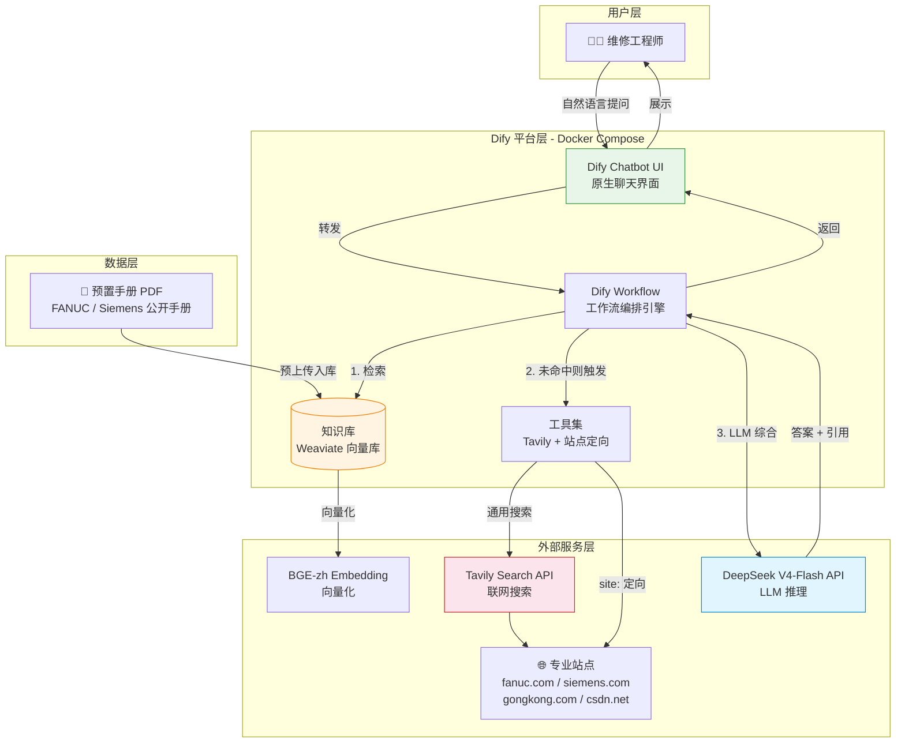
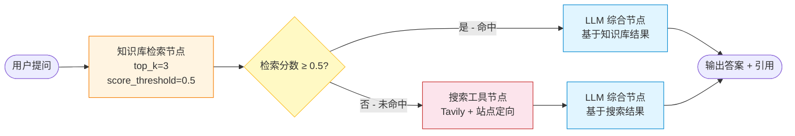
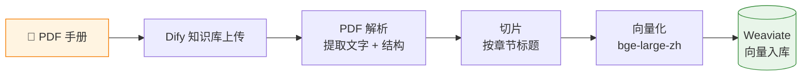
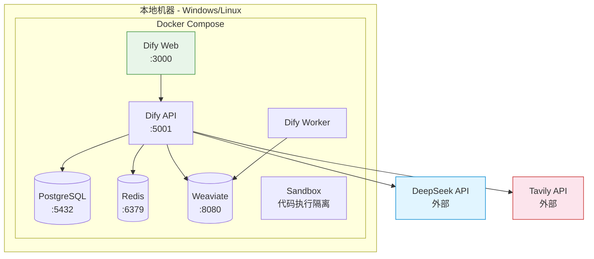

# 制造业设备维修知识库智能问答平台

## PRD 与技术架构设计文档

> **文档版本**：v1.0
> **日期**：2026-07-19
> **项目阶段**：初期规划
> **文档性质**：基于 grill-me 5 轮深度追问后的需求收敛与技术选型

---

## 目录

- [第一部分：产品需求文档（PRD）](#第一部分产品需求文档prd)
  - [1. 项目概述](#1-项目概述)
  - [2. 用户画像与场景](#2-用户画像与场景)
  - [3. 功能需求](#3-功能需求)
  - [4. 非功能需求](#4-非功能需求)
  - [5. 验收标准](#5-验收标准)
  - [6. MVP 边界与范围排除](#6-mvp-边界与范围排除)
- [第二部分：技术选型与架构设计](#第二部分技术选型与架构设计)
  - [1. 技术栈总览](#1-技术栈总览)
  - [2. 系统架构](#2-系统架构)
  - [3. Dify Workflow 设计](#3-dify-workflow-设计)
  - [4. 知识库构建 Pipeline](#4-知识库构建-pipeline)
  - [5. 搜索工具配置](#5-搜索工具配置)
  - [6. LLM 与 Prompt 设计](#6-llm-与-prompt-设计)
  - [7. 部署方案](#7-部署方案)
- [第三部分：风险与实施路线图](#第三部分风险与实施路线图)
  - [1. 关键风险与应对](#1-关键风险与应对)
  - [2. 实施阶段划分](#2-实施阶段划分)
  - [3. 关键里程碑](#3-关键里程碑)
- [附录 A：Grill-me 决策记录](#附录-agrill-me-决策记录)

---

# 第一部分：产品需求文档（PRD）

## 1. 项目概述

### 1.1 项目名称

**制造业设备维修知识库智能问答平台**

### 1.2 项目背景

制造业设备故障维修长期面临三大痛点：
- **纸质手册/旧工单检索耗时**：工程师遇到故障时翻阅手册效率低下
- **老师傅经验难传承**：隐性知识随人员流动流失
- **同类故障重复排查**：缺乏历史案例的语义化检索能力

传统方式无法解决"经验数字化 + 语义检索"的核心诉求，而大模型 + RAG 技术为这一问题提供了新的解决路径。

### 1.3 项目定位

> **本项目是一个功能与边界完善的演示型 Demo，非生产级应用。**

- **目标**：验证 Dify + RAG 技术栈在制造业设备维修垂直场景的可行性
- **非目标**：不替代企业真实 CMMS/EAM 系统，不承担生产环境运维职责
- **演示导向**：以 3 个典型故障问答场景的成功演示为验收标准

### 1.4 项目方向说明

经过 grill-me 深度追问，项目方向从最初的「Agentic RAG」调整为「**Pipeline RAG（工作流编排 RAG）**」。理由：

| 维度 | Agentic RAG（原方向） | Pipeline RAG（当前方向） |
|------|---------------------|------------------------|
| 决策机制 | LLM 自主决定何时检索 | 工作流固定流程 |
| 稳定性 | 较低（LLM 决策有不确定性） | **高**（流程可控） |
| 演示效果 | 有"AI 思考"故事感 | 流程清晰可预测 |
| Token 消耗 | 高 | 低 |
| 适用性 | 探索性任务 | **Demo 演示** ✅ |

**稳定性优先**是 Demo 阶段的核心原则——演示时不能翻车。

---

## 2. 用户画像与场景

### 2.1 目标用户

| 角色 | 占比 | 核心诉求 | 使用频率 |
|------|------|---------|---------|
| **一线维修工程师**（主力） | 80% | 故障现场快速获取排查方案 | 高频，按需触发 |
| **设备主管/工艺工程师**（次要） | 20% | 知识沉淀、验证答案准确性 | 低频，定期复核 |

### 2.2 核心痛点

1. **手册检索低效**：纸质手册翻阅慢，电子手册 Ctrl+F 无法理解语义
2. **经验传承断层**：老师傅退休后，排障套路随之流失
3. **重复排查浪费**：同类故障在不同班次被反复摸索

### 2.3 典型使用场景

#### 场景 1：手册命中场景

```
工程师输入：「FANUC 0i-MF 系统主轴异响，报警代码 SP-2003」

系统返回：
  故障可能原因：
    1. 主轴轴承磨损（概率 60%）
    2. 主轴电机异常（概率 25%）
    3. 传动带松动（概率 15%）

  排查步骤：
    Step 1: 检查主轴轴承运转状态，听诊异响位置
    Step 2: 测量主轴径向跳动（标准值 ≤ 0.005mm）
    Step 3: 若轴承正常，检查电机电流是否超标

  引用来源：
    📄 FANUC 0i-MF 维修手册.pdf - 第 142 页「主轴报警代码表」
    📄 FANUC 0i-MF 维修手册.pdf - 第 386 页「主轴机械维护」
```

#### 场景 2：联网兜底场景

```
工程师输入：「西门子 840D sl 驱动模块过流故障怎么处理」

系统返回：
  故障可能原因：
    1. 驱动器功率模块 IGBT 损坏
    2. 电机电缆短路或接地
    3. 负载机械卡死导致过载

  排查步骤：
    Step 1: 断电检查驱动器功率模块，测量 IGBT 阻值
    Step 2: 用兆欧表检测电机电缆绝缘
    ⚠️ Step 3: 若需带电测试，必须由持证电工操作

  引用来源：
    🔗 https://support.industry.siemens.com/.../drive_overcurrent
    🔗 https://www.gongkong.com/article/202403/840d-sl.html
```

#### 场景 3：多轮追问场景

```
第一轮：
  工程师：「CNC 加工中心换刀故障」
  系统：[返回换刀故障的通用排查方案]

第二轮（追问）：
  工程师：「如果换刀臂卡在中间位置怎么办」
  系统：[基于上下文，返回换刀臂卡死的应急处理步骤]
```

---

## 3. 功能需求

### 3.1 核心功能清单

| 编号 | 功能 | 优先级 | 说明 |
|------|------|--------|------|
| F1 | 智能问答 | P0 | 自然语言提问，返回结构化答案 |
| F2 | 引用溯源 | P0 | 答案附带来源（手册章节 / 网页 URL） |
| F3 | 历史会话 | P1 | 保存对话历史，支持多轮追问 |
| F4 | 混合检索 | P0 | 私有知识库优先 + 联网搜索兜底 |
| F5 | 安全警告 | P1 | 涉及危险操作时标注 ⚠️ 警告 |

### 3.2 功能详情

#### F1 - 智能问答

- **输入**：自然语言描述故障现象（支持中英文混排，如「SP-2003 报警」）
- **输出结构**：
  - 故障可能原因（按概率排序）
  - 排查步骤（分步骤、可执行）
  - 引用来源（手册章节 / 网页 URL）
- **响应时间**：≤ 15 秒（含联网搜索场景）

#### F2 - 引用溯源

- **私有知识库命中**：显示文档名 + 页码 + 命中片段
- **联网搜索命中**：显示网页标题 + URL + 摘要
- **格式**：Dify 原生引用块，可点击展开查看原文

#### F3 - 历史会话

- 使用 Dify 原生会话管理
- 支持多轮追问（上下文窗口 1M token，足够长对话）
- 会话列表可查看、删除

#### F4 - 混合检索

- **优先级**：私有知识库 > 联网搜索
- **触发逻辑**：知识库检索分数 < 0.5 时，自动触发联网搜索
- **联网搜索范围**：通用搜索 + 制造业专业站点定向搜索

### 3.3 非功能需求（概览，详见第二部分）

- **性能**：单次问答 ≤ 15 秒
- **可用性**：本地部署，无 SLA 要求（Demo）
- **安全**：无用户系统，单用户访问，API Key 环境变量管理

---

## 4. 非功能需求

| 维度 | 要求 | 说明 |
|------|------|------|
| 响应时间 | ≤ 15 秒 | 含联网搜索；纯知识库命中应 ≤ 5 秒 |
| 并发 | 单用户 | Demo 无并发需求 |
| 可用性 | 本地运行 | 不保证 7x24，演示前手动启动 |
| 数据安全 | 公开数据不涉密 | 仅使用公开手册，不碰真实企业数据 |
| API Key 管理 | 环境变量 | 不硬编码，不入 Git |
| 部署形态 | Docker Compose 本地 | 一键启动，不依赖云服务 |

---

## 5. 验收标准

### 5.1 验收标准

> **Demo 通过条件**：以下 3 个典型场景在本地环境成功演示，无报错、无超时、答案合理。

| 场景 | 输入 | 验收点 |
|------|------|--------|
| 场景 1 | 「FANUC 0i-MF 主轴异响 SP-2003」 | 知识库命中，返回排查步骤 + 手册引用 |
| 场景 2 | 「西门子 840D sl 驱动过流」 | 知识库未命中，联网搜索返回有效结果 + URL |
| 场景 3 | 换刀故障 + 追问换刀臂卡死 | 多轮对话上下文连贯，第二轮基于第一轮设备类型回答 |

### 5.2 不做的事

- ❌ 不做评估集 / 准确率指标
- ❌ 不做用户系统 / 登录 / 权限
- ❌ 不做工单流转 / CMMS 集成
- ❌ 不做预测性维护
- ❌ 不做知识自动抽取
- ❌ 不做用户上传 PDF（预置知识库代替）

---

## 6. MVP 边界与范围排除

### 6.1 MVP 包含

```
✅ 智能问答（结构化输出）
✅ 引用溯源（手册 + 网页）
✅ 历史会话（Dify 原生）
✅ 混合检索（知识库 + 联网）
✅ 预置知识库（2-3 份公开手册）
```

### 6.2 MVP 排除（留给 v2）

```
❌ 用户上传 PDF 临时灌库
❌ 经验反馈闭环
❌ 多用户 / 权限 / 租户隔离
❌ 工单系统集成
❌ 预测性维护
❌ 知识自动抽取
❌ 评估集与准确率指标
```

---

# 第二部分：技术选型与架构设计

## 1. 技术栈总览

| 层级 | 技术选型 | 版本/规格 | 选型理由 |
|------|---------|----------|---------|
| **LLM** | DeepSeek-V4-Flash | `deepseek-v4-flash` | 思考模式 + Function Calling 错误率 2% + ¥1/百万输入 + 1M 上下文 |
| **Embedding** | bge-large-zh-v1.5 | 中文 SOTA | 开源免费 + Dify 内置支持 + 中文优化 |
| **向量数据库** | Weaviate | Dify 默认 | Docker 自带 + 零额外配置 + Demo 量级足够 |
| **通用搜索** | Tavily API | 免费 1000 次/月 | 专为 AI agent 设计 + 结构化返回 |
| **专业站点定向** | 自定义 Dify 工具 | site: 语法封装 | 厂商官网 + 工控论坛定向检索 |
| **编排平台** | Dify 社区版 | Docker Compose | Workflow 可视化 + 原生聊天 UI + 知识库 |
| **前端** | Dify 原生聊天 UI | — | 零自研，Demo 最快路径 |
| **部署** | Docker Compose | 本地 | 一键启动，不依赖云 |

### 1.1 关键选型决策说明

#### 为什么选 DeepSeek-V4-Flash 而非 V4-Pro？

| 维度 | V4-Flash | V4-Pro |
|------|---------|--------|
| 输入价格 | ¥1/百万 token | ¥12/百万 token |
| 输出价格 | ¥2/百万 token | ¥24/百万 token |
| 推理能力 | 接近 Pro | 顶级 |
| Demo 适用性 | ✅ 够用 | 过剩 |

**结论**：Demo 阶段 V4-Flash 性价比远高于 V4-Pro。

#### ⚠️ DeepSeek API 旧 ID 停用警告

> **关键时间点**：`deepseek-chat` 和 `deepseek-reasoner` 将于 **2026-07-24 15:59 UTC** 停用。
>
> **必须使用**：`deepseek-v4-flash` 或 `deepseek-v4-pro`
>
> **当前日期**：2026-07-19，距停用仅剩 5 天！

---

## 2. 系统架构

### 2.1 架构总览图



### 2.2 组件说明

| 组件 | 职责 | 部署形态 |
|------|------|---------|
| Dify Chatbot UI | 用户交互界面，展示答案与引用块 | Docker 容器（Dify Web） |
| Dify Workflow | 工作流编排引擎，固定检索-判断-生成流程 | Docker 容器（Dify API + Worker） |
| Weaviate 向量库 | 存储手册切片的向量索引 | Docker 容器（Dify 自带） |
| DeepSeek V4-Flash | LLM 推理，生成结构化答案 | 外部 API（DeepSeek 云服务） |
| BGE-zh Embedding | 文档与查询向量化 | Docker 容器（Dify 内置或外挂） |
| Tavily API | 联网搜索工具 | 外部 API |
| 自定义站点定向工具 | 封装 Tavily + site: 语法 | Dify 自定义工具（OpenAPI Schema） |

---

## 3. Dify Workflow 设计

### 3.1 工作流流程图



### 3.2 节点配置详情

#### 节点 1：Start

- **输入变量**：`user_query`（string）
- **来源**：Dify Chatbot UI 用户输入

#### 节点 2：Knowledge Retrieval（知识库检索）

- **知识库**：预置的 FANUC / Siemens 手册库
- **检索参数**：
  - `top_k`: 3
  - `score_threshold`: 0.5
  - `rerank`: 开启（使用 Dify 内置 reranker）
- **输出变量**：
  - `retrieved_chunks`: 命中的文档片段列表
  - `retrieval_score`: 最高相似度分数

#### 节点 3：Condition（条件判断）

- **判断逻辑**：`retrieval_score >= 0.5`
- **分支 A（命中）**：直接进入 LLM 综合节点
- **分支 B（未命中）**：进入搜索工具节点

#### 节点 4：Tool（搜索工具，仅分支 B 触发）

- **工具 1**：Tavily 通用搜索
  - 输入：`user_query`
  - 输出：`web_results`（top 5 网页摘要 + URL）
- **工具 2**：站点定向搜索
  - 输入：`user_query` + 自动追加 `site:fanuc.com OR site:siemens.com OR site:gongkong.com OR site:csdn.net`
  - 输出：`site_results`（top 3 专业站点结果）

#### 节点 5：LLM（综合生成）

- **模型**：`deepseek-v4-flash`
- **思考模式**：开启，`reasoning_effort=high`
- **输入**：
  - 分支 A：`user_query` + `retrieved_chunks`
  - 分支 B：`user_query` + `web_results` + `site_results`
- **输出**：结构化答案（故障原因 + 排查步骤 + 引用来源）

#### 节点 6：End

- **输出**：LLM 生成的答案 + 引用块（Dify 自动渲染）

---

## 4. 知识库构建 Pipeline

### 4.1 数据来源

> **Demo 阶段使用公开手册，不涉及企业机密数据。**

| 文档 | 来源 | 用途 |
|------|------|------|
| FANUC 0i-MF 维修手册（公开版） | FANUC 官网 / 工控论坛 | 场景 1 演示（知识库命中） |
| Siemens 840D sl 操作手册（公开版） | Siemens 官网 | 知识库扩充 |
| CNC 加工中心故障案例集 | 工控论坛整理 | 场景 3 演示（多轮追问） |

### 4.2 文档处理流程



### 4.3 切片策略

| 参数 | 值 | 理由 |
|------|-----|------|
| 切片方式 | 按章节标题 | 设备手册结构清晰，章节天然分块 |
| chunk_size | 500 tokens | 兼顾语义完整性和检索精度 |
| overlap | 50 tokens | 避免章节边界信息丢失 |
| 分段规则 | 自动识别 H1/H2 标题 | Dify 内置支持 |

### 4.4 向量化配置

- **模型**：`bge-large-zh-v1.5`
- **维度**：1024
- **部署**：Dify 内置（或外挂本地推理服务）
- **成本**：开源免费，无 API 调用费用

---

## 5. 搜索工具配置

### 5.1 Tavily 通用搜索工具

#### 注册与配置

1. 访问 https://tavily.com 注册账号
2. 获取 API Key（免费 1000 次/月）
3. 在 Dify「自定义工具」中配置 OpenAPI Schema

#### OpenAPI Schema（简化版）

```yaml
openapi: 3.0.0
info:
  title: Tavily Search
  version: 1.0.0
servers:
  - url: https://api.tavily.com
paths:
  /search:
    post:
      operationId: tavilySearch
      summary: Search web for manufacturing equipment repair info
      requestBody:
        required: true
        content:
          application/json:
            schema:
              type: object
              properties:
                api_key:
                  type: string
                  description: Tavily API key
                query:
                  type: string
                  description: Search query
                max_results:
                  type: integer
                  default: 5
                search_depth:
                  type: string
                  enum: [basic, advanced]
                  default: basic
              required: [api_key, query]
      responses:
        '200':
          description: Search results with URLs and snippets
```

### 5.2 站点定向搜索工具

#### 实现方式

封装 Tavily，自动追加 `site:` 语法：

```python
def site_directed_search(query: str) -> dict:
    """
    制造业专业站点定向搜索
    自动追加 site: 语法，限定专业站点范围
    """
    sites = [
        "site:fanuc.com",          # FANUC 官网
        "site:siemens.com",         # Siemens 官网
        "site:gongkong.com",        # 中华工控网
        "site:csdn.net",            # CSDN 技术文章
        "site:zhihu.com"            # 知乎工业话题
    ]

    enhanced_query = f"{query} ({' OR '.join(sites)})"
    return tavily_search(query=enhanced_query, max_results=3)
```

#### 在 Dify 中的配置

将上述逻辑封装为独立 API 服务（可用 FastAPI 部署），在 Dify 中作为自定义工具接入。

---

## 6. LLM 与 Prompt 设计

### 6.1 LLM 配置

| 参数 | 值 | 说明 |
|------|-----|------|
| 模型 | `deepseek-v4-flash` | ⚠️ 不要用 `deepseek-chat`（7/24 停用） |
| 思考模式 | 开启 | `thinking.type=enabled` |
| reasoning_effort | `high` | 复杂 Agent 场景推荐 |
| 上下文窗口 | 1M token | 可容纳整本手册 |
| 温度 | 0.3 | 降低随机性，提高答案稳定性 |

### 6.2 System Prompt

```
你是一位制造业设备维修智能助手，专注于 CNC 数控机床、PLC、工业机器人等设备的故障诊断与维修指导。

【回答规则】
1. 严格基于检索到的资料回答，不编造未在资料中出现的信息
2. 答案必须按以下结构输出：
   - 故障可能原因（按概率从高到低排序，标注概率百分比）
   - 排查步骤（分步骤编号，每步可执行）
   - 引用来源（每个关键结论后标注）
3. 引用格式：
   - 私有手册：【来源：文档名 第X页】
   - 网页资料：【来源：URL】
4. 如果检索资料不足以回答，明确告知"现有资料无法完全解答该问题，建议联系设备厂商技术支持"
5. 涉及安全操作的步骤，必须加 ⚠️ 警告标识，例如：
   ⚠️ 此步骤涉及高压电操作，必须由持证电工执行

【输出示例】
故障可能原因：
1. 主轴轴承磨损（概率 60%）
2. 主轴电机异常（概率 25%）
3. 传动带松动（概率 15%）

排查步骤：
Step 1: 检查主轴轴承运转状态【来源：FANUC 手册 第142页】
Step 2: 测量主轴径向跳动（标准值 ≤ 0.005mm）【来源：FANUC 手册 第386页】
⚠️ Step 3: 若需带电测试，必须由持证电工操作
```

---

## 7. 部署方案

### 7.1 部署架构



### 7.2 环境要求

| 资源 | 最低配置 | 推荐配置 |
|------|---------|---------|
| CPU | 4 核 | 8 核 |
| 内存 | 8 GB | 16 GB |
| 磁盘 | 20 GB | 50 GB |
| Docker | 20.10+ | 最新版 |
| Docker Compose | v2.0+ | 最新版 |

### 7.3 环境变量配置

在 Dify 的 `.env` 文件中配置：

```bash
# DeepSeek API
DEEPSEEK_API_KEY=your_deepseek_api_key_here

# Tavily API
TAVILY_API_KEY=your_tavily_api_key_here

# Dify 基础配置
CONSOLE_API_URL=http://localhost:5001
CONSOLE_WEB_URL=http://localhost:3000
SERVICE_API_URL=http://localhost:5001
APP_WEB_URL=http://localhost:3000
```

### 7.4 启动步骤

```bash
# 1. 克隆 Dify 社区版
git clone https://github.com/langgenius/dify.git
cd dify/docker

# 2. 复制环境变量模板
cp .env.example .env

# 3. 编辑 .env，填入 API Key（见 7.3）

# 4. 启动所有服务
docker compose up -d

# 5. 验证服务状态
docker compose ps

# 6. 访问 Dify 控制台
# 浏览器打开 http://localhost:3000
# 首次访问需创建管理员账号
```

### 7.5 Dify 内部配置步骤

1. **添加 DeepSeek 模型供应商**
   - 设置 → 模型供应商 → DeepSeek
   - 填入 API Key
   - 模型选择 `deepseek-v4-flash`（⚠️ 不要选 deepseek-chat）

2. **创建知识库**
   - 知识库 → 创建知识库
   - 上传 FANUC / Siemens 手册 PDF
   - 切片方式：自动
   - Embedding 模型：bge-large-zh-v1.5

3. **配置自定义工具**
   - 工具 → 自定义工具 → 创建
   - 粘贴 Tavily 的 OpenAPI Schema
   - 填入 Tavily API Key

4. **创建 Workflow 应用**
   - 创建应用 → Workflow
   - 按 3.2 节配置各节点
   - 发布为 Chatbot

5. **测试演示场景**
   - 在 Chatbot 界面输入 3 个验收场景
   - 确认答案结构、引用、响应时间符合预期

---

# 第三部分：风险与实施路线图

## 1. 关键风险与应对

### 1.1 P0 级风险（必须立即处理）

| 风险 | 影响 | 应对措施 |
|------|------|---------|
| **DeepSeek 旧 ID 停用**（2026-07-24） | Demo 直接报废 | ⚠️ **必须使用 `deepseek-v4-flash`**，绝不使用 `deepseek-chat` |
| **Dify 未适配 V4 模型** | 无法在 Dify 中选择 V4 | 通过「自定义模型 / OpenAI 兼容接口」方式接入 |

### 1.2 P1 级风险（需提前准备）

| 风险 | 影响 | 应对措施 |
|------|------|---------|
| **Tavily 免费额度耗尽**（1000 次/月） | 联网搜索失效 | 演示前控制测试次数；备选 Bing Search API |
| **制造业专业资料搜索覆盖度低** | 联网兜底场景答非所问 | 提前测试 3 个验收场景；扩充 site: 站点列表 |
| **PDF 手册为扫描件** | Dify 无法提取文字 | 使用 OCR 工具预处理（如 PaddleOCR） |

### 1.3 P2 级风险（可接受）

| 风险 | 影响 | 应对措施 |
|------|------|---------|
| **本地机器配置不足** | Docker 启动慢 / OOM | 关闭其他大型程序；增加虚拟内存 |
| **答案出现幻觉** | 演示时答案不准确 | System Prompt 强制"不编造"；演示前人工验证 |

---

## 2. 实施阶段划分

### Phase 1：环境搭建（预计 0.5 天）

- [ ] 安装 Docker + Docker Compose
- [ ] 克隆 Dify 社区版并启动
- [ ] 注册 DeepSeek API Key（确认 V4 可用）
- [ ] 注册 Tavily API Key

### Phase 2：知识库构建（预计 0.5 天）

- [ ] 收集 2-3 份公开设备手册 PDF
- [ ] 在 Dify 中创建知识库并上传
- [ ] 配置 bge-large-zh-v1.5 Embedding
- [ ] 验证知识库检索效果（测试 5 个查询）

### Phase 3：Workflow 配置（预计 1 天）

- [ ] 配置 Tavily 自定义工具
- [ ] 配置站点定向搜索工具
- [ ] 搭建 Workflow 画布（6 个节点）
- [ ] 编写 System Prompt
- [ ] 调试条件分支逻辑

### Phase 4：测试与演示（预计 0.5 天）

- [ ] 测试场景 1（知识库命中）
- [ ] 测试场景 2（联网兜底）
- [ ] 测试场景 3（多轮追问）
- [ ] 优化 Prompt 与检索参数
- [ ] 准备演示话术

---

## 3. 关键里程碑

| 里程碑 | 完成标志 | 预计时间 |
|--------|---------|---------|
| M1: 环境就绪 | Dify 可访问，DeepSeek V4 可调用 | Phase 1 结束 |
| M2: 知识库可用 | 手册入库，检索返回相关片段 | Phase 2 结束 |
| M3: Workflow 跑通 | 6 节点工作流执行无报错 | Phase 3 结束 |
| M4: Demo 验收通过 | 3 个场景演示成功 | Phase 4 结束 |

---

## 附录 A：Grill-me 决策记录

> 本文档的所有决策均经过 grill-me 5 轮深度追问验证，以下是关键决策的追问轨迹。

### 决策 1：项目方向从 Agentic RAG 调整为 Pipeline RAG

- **追问点**：Agentic RAG 稳定性不足，Demo 演示易翻车
- **决策**：采用 Dify Workflow 固定流程，稳定性优先
- **代价**：失去"LLM 自主决策"的演示亮点

### 决策 2：放弃用户上传 PDF，改用预置知识库

- **追问点**：Dify 原生 UI 不支持终端用户上传文件到知识库
- **决策**：Demo 前预上传 2-3 份手册，演示话术调整
- **代价**：失去"用户即传即用"的交互感

### 决策 3：LLM 选型 DeepSeek-V4-Flash

- **追问点**：DeepSeek 旧 ID（deepseek-chat）将于 2026-07-24 停用
- **决策**：使用 `deepseek-v4-flash`，开启思考模式
- **教训**：模型版本等时效性信息必须联网核实，不能凭记忆判断

### 决策 4：三层混合检索策略

- **追问点**：通用搜索对制造业垂直领域覆盖差
- **决策**：通用搜索 + 专业站点定向 + 预置知识库三层叠加
- **代价**：工具配置复杂度略增

### 决策 5：Dify 原生 UI + 本地 Docker 部署

- **追问点**：是否自研前端
- **决策**：用 Dify 原生聊天 UI，零前端自研，本地 Docker 部署
- **代价**：UI 定制性差，但 Demo 够用

---

## 文档结束

> 本文档基于 2026-07-19 的 grill-me 会话生成。
> 技术选型中的 DeepSeek V4 信息已通过联网搜索核实（2026-07-19）。
> 如需调整任何决策，请发起新一轮 grill-me 会话。
